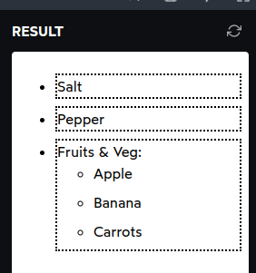

# Anatomy of a Style Rule

simple example of css snippet:

```css
.error-text {
  color: red;
}
```

Game Selector Selection

```css
/* Question 1: Select the property below: */
p {
  margin: 32px;
}
/* ans: margin */
```

```css
/* Question 2: Select the selector below: */
.apple {
  background-color: red;
  border-radius: 50%;
}
/* ans: .apple */
```

```css
/* Question 3: Select the first declaration below: */

.code-snippet {
  padding: 32px;
  white-space: pre-wrap;
}
/* ans : padding: 32px; */
```

```css
/* Question 4: Select the selector below: */
h1 {
  font-size: 2rem;
  font-weight: bold;
  letter-spacing: 0.1em;
}
/* ans: h1 */
```

```css
/* Question 5: Select the rule below: */
p {
  color: red;
  font-family: sans-serif;
}

/* ans : 
p {
  color: red;
  font-family: sans-serif;
}
The entier thing in beloq is the rule
*/
```

```css
/* Question 6: Select the unit below: */
p {
  padding-top: 24px;
}
/* ans: px */
```

```css
/* Question 7: Select the second declaration below: */
main {
  max-width: 65ch;
  margin: 0 auto;
}

/* ans: margin: 0 auto; */
```

```css
/* Question 8: Select the first rule below: */
p {
  font-size: 1rem;
}

.big-paragraph {
  font-size: 1.25rem;
  font-weight: 500;
}

/* ans: 
p {
  font-size: 1rem;
} */
```

# Media Queries

The web is an incredibly broad platform: the same HTML and CSS might be tasked with running on a 5" phone screen and a 72" TV!

To accomodate different screen size and shape css feature `Media Queries` allows us to apply css in different scenarios

Responsive design is a huge part of modern front-end development

Media queries use the `@media` syntax. You can kinda think of it as an if statement in `JavaScript`:

```js
// Javascript
if (condition) {
  // Some JS that will run if the condition is met.
}
```

```css
/* CSS */
.large-screens {
  display: none;
}

@media (min-width: 300px) {
  .large-screens {
    display: block;
  }
  .small-screens {
    display: none;
  }
}
```

`display: none` is a declaration that removes an element from the rendering process; it's as if it doesn't exist.

By default, we'll hide any elements with the` large-screens class`. If our window is at least `300px wide`, however, we apply special overrides. This includes showing `large-screens` elements, and hiding `small-screens` elements.

## Valid conditions

The syntax looks quite a lot like the declaration syntax, especially since `max-width: 1023px` is a valid CSS declaration! Unfortunately, this is misleading; In the context of a `media query`, _max-width is a “media feature”_, not a CSS property

Not all CSS properties have corresponding media features. For example, this snippet is not valid:

```css
/* 🚫 Not valid, since `font-size` can't be queried */
@media (font-size: 32px) {
}
```

# Selectors

CSS comes with an incredibly rich set of selectors, and those selectors can be mixed and matched in interesting ways.

The most straightforward selectors target a specific tag or class:

```css
/* Turn all links red! */
a {
  color: red;
}

/*
  Remove the underline from all elements that
  have been given a class of `navigation-link`
*/
.navigation-link {
  text-decoration: none;
}
```

### Pseudo-classes

1. hover

   we have a button and we want to change its text color when we hover it. We can do this with the `:hover` pseudo-class:

   ```css
   button:hover {
     color: blue;
   }
   ```

   Pseudo-classes let us apply a chunk of CSS based on an element's current state.

   This is similar to onMouseEnter / onMouseLeave events in JavaScript, but with built-in state management.

2. focus

   The :focus pseudo-class allows us to apply styles exclusively when an interactive element has focus:

   ```css
   button:focus {
     border: 2px solid royalblue;
     background: royalblue;
     color: white;
   }
   ```

3. checked

   The `:checked` pseudo-class only applies to checkboxes and radio buttons that are "filled in".

   ```css
   input:checked {
     width: 24px;
     height: 24px;
   }
   ```

4. first/last child

   The Pseudo-classes they have condtitional logic.
   the example is set of paragraphs within a `<section>`:

   ```css
   section {
     padding: 24px;
     background-color: white;
   }

   p {
     margin-bottom: 1em;
   }
   ```

   ```html
   <section>
     <p>This is a paragraph!</p>
     <p>This is another paragraph!</p>
     <p>What do you know, it's a third paragraph!</p>
   </section>
   ```

   But if we render this html code to the web browser. In the final paragraph tag <p> will carry margin-bottom: 1em like this.

   

   so, to solve this:

   ```css
   p {
     margin-bottom: 1em;
   }
   p:last-child {
     margin-bottom: 0px;
   }
   ```

   Here's how this works: The `:last-child` pseudo-class will only select `<p>` tags which are the final element within its container. It needs to be the last child within its parent.

   Similarly, the `:first-child` pseudo-class will match the first child within a parent container. For example:

   ```css
   li:first-child {
     color: red;
   }
   ```

In addition to :first-child and `:last-child`, we also have `:first-of-type` and `:last-of-type`.

```css
p:first-of-type {
  color: red;
}
```

```html
<section>
  <h1>Hello world!</h1>
  <p>This is a paragraph!</p>
  <p>This is another paragraph!</p>
</section>
```

Result:


The `:first-of-type` pseudo-class ignores any siblings that aren't of the same type. In this case, `p:first-of-type` is going to select the first paragraph within a container, regardless of whether or not it's the first child.

<br>

## Pseudo-elements

Pseudo-elements are like pseudo-classes, but they don't target a specific state.

1. placeholder

   For example, we can style the placeholder text in a form input with `::placeholder`:

   ```html
   <style>
     input {
       font-size: 1rem;
     }
     input::placeholder {
       color: goldenrod;
     }
   </style>

   <label>
     Postal Code:
     <input type="text" placeholder="A1A 1A1" />
   </label>
   ```

   In terms of syntax, pseudo-elements use two colons `(::)`, though some pseudo-elements also support single-colon syntax.

   In the example code above we did not create a `<placeholder>` element, but by adding the placeholder attribute to the `<input>` tag, a pseudo-element is created.

   This is why they're called **pseudo-elements** — these selectors target elements in the DOM that we haven't explicitly created with HTML tags.

2. before and after

   Two of the most common pseudo-elements are `::before` and `::after`.

   example:

   ```html
   <style>
     p::before {
       content: "→ ";
       color: deeppink;
     }
     p::after {
       content: " ←";
       color: deeppink;
     }
   </style>

   <p>This paragraph has little arrows!</p>
   ```

   These pseudo-elements are added inside the element, right before and after the element's content.

<br>

## Combinators

In CSS, we can differentiate between _children_ and _descendants_. Think of a family tree: a child is only one level down from the parent. A descendant might be 1 level down (child), 2 levels down (grandchild), 3 levels down…

kind of css combinators:

- Descendant Selector
  `div p`

- Child Selector (>)
  `div > p`

- Adjacent Sibling Selector (+)
  `div + p`
- General Sibling Selector (~)
  `p ~ ul`

example

```html
<style>
  li {
    margin-bottom: 8px;
  }

  .main-list > li {
    border: 2px dotted;
  }
</style>

<ul class="main-list">
  <li>Salt</li>
  <li>Pepper</li>
  <li>
    Fruits & Veg:
    <ul>
      <li>Apple</li>
      <li>Banana</li>
      <li>Carrots</li>
    </ul>
  </li>
</ul>
```

Result



<br>

## Exercises

```html
<style>
  /* TODO */
  a {
    color: deeppink;
    text-decoration: none;
  }
  a:hover {
    text-decoration: underline;
  }
  aside > p > a {
    color: black;
    text-decoration: underline;
  }
  aside > p > a:hover {
    text-decoration: none;
  }
</style>

<article class="recipe">
  <h2>Chicken Vindaloo</h2>
  <p>
    “Vindaloo” is a popular Indian <a href="">curry dish</a> that calls for meat
    to be marinated in a highly flavorful spicy mixture with vinegar, then
    quickly cooked up when you’re ready to eat.
  </p>
  <p>
    While this dish has a long list of spices, most are quite common in the
    average spice rack. If you find you're missing one, it's not a deal breaker.
    You will still have a lovely, fragrant curry.
  </p>
  <aside>
    <p>
      Quick warning: <strong>this recipe is <em>spicy</em></strong
      >. <a href="">Click here</a> for an alternative recipe with less heat.
    </p>
  </aside>
</article>
```

<br>

## Color

We can adjust the text color of a specified element using the color property:
ex:

```css
strong {
  color: red;
}
```

1.  Color formats

    A lot of developers use hex codes `(#FF0000)`, but I believe there are better options!

    the other color format is HSL (Hue/Saturation/Lightness).
    example use:

    ```css
    .box {
      background-color: hsl(0deg 100% 50%);
    }
    ```

    You can use HSL colors anywhere you'd normally put a hex code:

    ```css
    .colorful-thing {
      color: hsl(200deg 100% 50%);
      border-bottom: 3px solid hsl(100deg 75% 50%);
    }
    ```

2.  Transparency

    Certain color formats allow us to supply an additional value for the alpha channel.

    This is a measure of opacity. At 1 (default), the color is fully opaque and solid. At 0, the color is invisible.

    Here's how we represent this in HSL:

    ```css
    .box {
      width: 50px;
      height: 50px;
    }
    .first.box {
      background-color: hsl(340deg 100% 50% / 1);
    }
    .second.box {
      background-color: hsl(340deg 100% 50% / 0.75);
    }
    .third.box {
      background-color: hsl(340deg 100% 50% / 0.5);
    }
    .fourth.box {
      background-color: hsl(340deg 100% 50% / 0.25);
    }
    ```

    ```html
    <div class="first box"></div>
    <div class="second box"></div>
    <div class="third box"></div>
    <div class="fourth box"></div>
    ```

    result :

    

    What's the deal with the slash?

    The `/` character is becoming a more common pattern in modern CSS. It isn't about division, it's about separation. `The slash` allows us to create groups of values. The first group is about the color. The second group is about its opacity.

3.  Background colors

    The `color` property only affects the color of the text. If we want to set a color to the element's background, we can use the `background-color` property.

    ```css
    em {
      background-color: hsl(50deg 100% 50%);
    }
    ```

    ```html
    <p>
      This is a paragraph with a
      <em>highlighted section</em>.
    </p>
    ```

<br>

## Units

The most popular unit for anything size-related is the pixel:

```css
.box {
  width: 1000px;
  margin-top: 32px;
  padding: 8px;
}
```

1. Ems

   The `em` unit is an interesting fellow. It's a relative unit, equal to the font size of the current element.

   If a heading has a font-size of 24px, and we give it a bottom padding of `2em`, we can expect that the element will have 48px of cushion underneath it (2 × 24px).

   ```css
   p {
     /* Change me! */
     font-size: 18px;

     padding-bottom: 2em;
     border: 1px solid;
   }
   ```

   ```html
   <p>This paragraph has a relative amount of bottom padding!</p>
   ```

   result:

   

2. Rems

   The rem unit is quite a lot like the em unit, with one crucial difference: it's always relative to the root element, the `<html>` tag.

   All of the rems across your app will be taking their cues from that root `HTML` tag. By default, the HTML tag has a font size of `16px`, so `1rem` will be equal to `16px`.

   ```css
   html {
     font-size: 16px;
   }

   h1 {
     font-size: 2rem;
     margin: 0;
   }

   h2 {
     font-size: 1.25rem;
     margin-bottom: 1.5rem;
     color: gray;
   }

   p {
     font-size: 1rem;
   }
   ```

   ```html
   <h1>What's a staple? The list expands.</h1>
   <h2>Jan. 1, 1991</h2>
   <p>
     Conventional agricultural wisdom holds that only a handful of crop species
     -- as few as 7 and no more than 30, depending on different assessments --
     account for most of the plant food consumed by humanity. But a new study
     says more than 100 species and possibly as many as 200 are important food
     sources.
   </p>
   ```

   Result:

   

   Please note, `you shouldn't actually set a px font size on the html tag`. This will override a user's chosen default font size.

3. Percentages

   The percentage unit is often used with width/height, as a way to consume a portion of the available space.

   ```css
   .box {
     width: 250px;
     height: 250px;
     background-color: pink;
   }

   .child {
     width: 50%;
     height: 75%;
     background-color: black;
   }
   ```

   ```html
   <div class="box">
     <div class="child"></div>
   </div>
   ```

   In this example, we've created a box with a fixed size (250px by 250px), and then added a child with a relative size. When the size of the .box element changes, the child will scale accordingly.

## Typography

1. Font families

   We can change which font is used with the font-family property:

   ```css
   font-family: Arial;
   ```

   It's called a “family” because each font consists of multiple character sets: for example, “Roboto” includes 12 individual sets: 6 font weights, with 2 variants (normal and italic):

   

   There are a handful of “web safe fonts”. These are fonts that come pre-installed on all major operating systems, like Arial, Times New Roman, Tahoma.

2. Web fonts

   A web font is a custom font that we load in our CSS, allowing us to use any font we like. For example, AirBnb developed its own font in-house, **Cereal**, and uses it across their web and native apps.

   For example, this is the snippet that Google Fonts provides, if we want to use `Roboto`, one of their hosted web fonts:

   ```html
   <link rel="preconnect" href="https://fonts.gstatic.com" />
   <link
     href="https://fonts.googleapis.com/css2?family=Roboto:wght@400;700&display=swap"
     rel="stylesheet"
   />
   ```

   This HTML snippet will make the web font available for us to use in our CSS. Here's how we'd use it:

   ```css
   font-family: "Roboto", Arial, sans-serif;
   ```

   I'm also specifying multiple comma-separated fonts here. This is known as a font stack. The idea is that the browser will use the first available font from the list.

3. Typical text formatting

   - **Bold text**

     We can create bold text with the font-weight property:

     ```css
     font-weight: bold;
     /* Light, thin text*/
     font-weight: 300;

     /* Normal text */
     font-weight: 400;

     /* Heavy, bold text */
     font-weight: 700;
     ```

   - **Italic text**

     We can apply italic text with this declaration:

     ```css
     font-style: italic;
     ```

   - **Underlined text**

     On the web, underlines carry a very specific meaning: they tend to be links.

     We can toggle an element's underline with the text-decoration property:

     ```css
     /* remove underlines from navigation links: */
     nav a {
       text-decoration: none;
     }
     ```

   - **Styles and semantics**

     The `<strong>` HTML tag is meant to convey that an element is critically important or urgent, like **“Warning: Product may explode if shaken”**.

     The `<em>` HTML tag is used for emphasis, the way one might emphasize a particular word in a sentence, like “these pretzels are making me _thirsty_.”

     Semantics are important because not everyone can see the cosmetic styles.

     For example, we might want to make an input's `<label>` bold, and we can do this purely in CSS, without using a `<strong>` tag.

   - **Alignment**

     We can shift characters horizontally using the `text-align` property:

     example:

     ```css
     p.left {
       text-align: left;
     }
     p.right {
       text-align: right;
     }
     p.center {
       text-align: center;
     }

     p {
       margin-bottom: 32px;
     }
     ```

     ```html
     <p class="left">This paragraph uses the default “left” alignment.</p>
     <p class="right">
       This one, meanwhile, pops over to the other side! It flips the default
       behaviour.
     </p>
     <p class="center">Finally, we end in the middle.</p>
     ```

     result:

     

     `text-align` is also capable of aligning other elements, like images. In general, though, we'll use other tools for those kinds of jobs. We should reserve `text-align` for text.

   - **Text transforms**

     We can tweak the formatting of our text using the text-transform property:

     ```css
     /* RENDER WITH ALL CAPS */
     text-transform: uppercase;

     /* Capitalize The First Letter Of Every Word */
     text-transform: capitalize;
     ```

     Why use text-transform when we can edit the HTML? It's advisable to use this CSS so that the “original” casing can be preserved.

   - **Spacing**

     We can tweak the spacing of our characters in two ways.

     1. We can tweak the horizontal gap between characters using the letter-spacing property.
     2. We can tweak the vertical distance between lines using the line-height property.

     ```html
     <style>
       /* Try tweaking these properties! */
       h3 {
         letter-spacing: 5px;
       }

       p {
         font-size: 1rem;
         line-height: 1.5;
       }
     </style>

     <h3>About Us</h3>
     <p>
       The Lumen Group was founded in 1984 in Berlin, Germany. We create
       purposeful products for the next generation of leaders and executives,
       luminaries and visionaries of tomorrow.
     </p>
     ```

     ```css
     h3 {
       /* These properties are decorative */
       font-size: 2rem;
       color: hsl(0deg 0% 30%);
       text-transform: uppercase;
       font-weight: 100;
     }
     ```

     `line-height` is a bit of an odd duck because it takes a unitless number. This number is multiplied by the element's `font-size` to calculate the actual `line height`.

     As an example, suppose we have the following CSS:

     ```css
     p {
       font-size: 2rem;
       line-height: 1.5;
     }
     ```

     We can calculate the actual height of each line by multiplying the `font-size` (2rem) by the `line-height` (1.5), for a derived value of 3rem.

<br>
