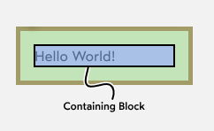
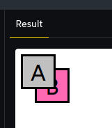
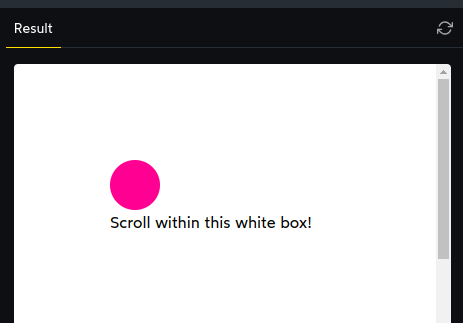

# Rendering Logic II

In this section, we're going to look at another layout mode: Positioned layout.

We can opt into Positioned layout using the position property. It can be set to `relative`, `absolute`, `fixed`, or `sticky`. Each one works in a unique way, like a mini-layout-algorithm within the layout algorithm.

## 1. Relative positioning

Of all the Positioned layout sub-genres, `relative` is the most subtle.

```css
.some-box {
  position: relative;
}
```

You can often slap `position: relative` on an element, and observe zero difference. It appears to have no effect!

In fact, it does two things:

1. Constrains certain children
2. Enables addtional css properties to be used

When we opt into Positioned layout, we enable a handful of new CSS properties, including:

- top
- left
- right
- bottom

We can use those directional values to shift the element around. With relative positioning, those values are relative to its _natural position_.

The big difference is that position _doesn't impact layout_.

```css
.with-margin {
  margin-top: 20px;
}
.with-position {
  position: absolute;
  top: 20px;
}
```


When we push a relatively-positioned element around with top/left/right/bottom, the browser acts like the element is still in its original position. The displacement is purely cosmetic.

Whether we use relative-positioning and top or margin-top, the pink box winds up in the same spot (20px lower than its natural position).

Similarly, when block items don't have a specified width, they can dynamically resize when, say, `margin-left` is increased. `left`, on the other hand, pushes an item around without ever changing its dimensions.

```css
.with-margin {
  margin-left: 40px;
}
.with-position {
  position: relative;
  left: 40px;
}
```


Notice how the right-hand column's box "seeps out" of the container, whilst the left-hand column's box gets narrower.

Finally, it's important to note that **relative** positioning can be applied to both `block` and `inline` elements. This allows us to nudge inline elements in a way that isn't really possible otherwise.

```css
strong {
  position: relative;
  top: -4px;
}
```


## 2. Absolute Positioning

What if we want to break the rules, though? What if we want to take an element out of this orderly flow, and stick it wherever we want?

In these cases, **absolute positioning** is our friend.

We generally use absolute positioning for things like:

- UI elements that need to float above the UI, like tooltips or dropdowns.

- Decorative elements that need to be stuck in certain positions (eg. abstract illustrations).

- Stacking multiple elements in the same place, like a deck of cards.

example:

```css
.pink.box {
  position: absolute;
  top: 0px;
  right: 0px;
  width: 75px;
  height: 75px;
  background: deeppink;
}
```

```html
<div class="pink box"></div>
<p>Hello World</p>
```


In Flow layout, we would expect the pink box to sit on top of the paragraph, since that's their order in the DOM. Because our pink box uses absolute positioning, though, two things are different:

1. The pink box is nestled up in the top-right corner of the preview frame.
2. The "Hello world" paragraph has shifted up, to fill the space the pink box would normally fill.

### Placement based on the frame

We can stick something in the corner, or otherwise position something based on the box it's being constrained by, ignoring its "natural" position.
We can do this with 4 properties: `top`, `left`, `right`, and `bottom`.

example:

```css
.pink.box {
  position: absolute;
  top: 20px;
  left: 25%;
  width: 75px;
  height: 75px;
  background: deeppink;
}
```


We've instructed the box to sit `20px` below the top edge of the frame, and `25%` away from the left edge. The percentage is based on the total amount of space available.


```css
.pink.box {
  position: absolute;
  top: 0px;
  right: 0px;
}

```

```html
<div class="pink box"></div>
<p>Paragraph One</p>
<p>Paragraph Two</p>
<p>Paragraph Three</p>
```


### Default placement

if you set position: absolute, but don't give it an anchor by setting `top` / `left` / `right` / `bottom`, here the example :

```css
.box {
  position: absolute;
  background: slateblue;
}
```


If we don't give our absolute element an anchor, it sits in its **default in-flow position**. I think of it as "`inheriting`" its default position from Flow layout.

### Effect on layout

When we set something to be `position: absolute`, we `pull it out of flow`.

```css
p {
  position: absolute;
}
```


The browser starts by putting that first paragraph in its natural position, at the top of the document, but because it's absolute, it still considers that space empty.

Next, the second paragraph gets added in its natural position, which is also right at the top, since the container is effectively “empty”.

This process will continue for each provided `absolute` element.

#### Collapsing parents

```css
.child {
  /* Toggle this property: */
  position: absolute;

  width: 200px;
  height: 200px;
  background: hotpink;
  opacity: 0.5;
}

.parent {
  border: 4px solid;
}
```


In this example, we have a pink box sitting within a black-border parent. When we toggle on that `position: absolute`, you'll notice that the parent "`collapses`" down, so that it's 8px tall (`4px top border, 4px bottom`).

## 2.1 Centering Trick

we can centering a box using `position: absolute`, `top`, `left`, `right`, `bottom`.

```css
.box {
  position: absolute;
  top: 0px;
  left: 0px;
  right: 0px;
  bottom: 0px;
  width: 100px;
  height: 100px;
  margin: auto;
  background: deeppink;
}
```

There are 4 important ingredients for this trick to work:

- absolute positioning (`position: absolute`)
- Equal distances from each edge (ideally `0px`)
- A fixed size (defined `width` and `height` properties)
- Hungry margins (`margin: auto`)

### The “inset” property

As we saw, the centering trick requires setting all 4 edge properties to the same value:

```css
.box {
  top: 0;
  left: 0;
  right: 0;
  bottom: 0;
}
```

This feels very tedious, and modern CSS has given us a more terse way to accomplish this:

```css
.box {
  inset: 0;
}
```

The `inset` property will set all 4 edge properties (`top`, `left`, `right`, and `bottom`) to the provided value.

```css
.box {
  position: absolute;
  inset: 25px;
  background: deeppink;
}

/* this is quivalent to: */

.box {
  position: absolute;
  top: 25px;
  left: 25px;
  right: 25px;
  bottom: 25px;
  background: deeppink;
}
```


This property is supported in all modern browsers — caniuse says that it's available for 92.6% of users.

## 3. Containing Blocks

In CSS, every HTML element has a “containing block”. A containing block is a rectangle that forms the bounds of the element's container.

To be precise: the paragraph is contained by a “containing block” the size and shape of the parent element's content box:



Flow layout uses containing blocks to figure out where on the screen to place the element.

When it comes to `absolute` positioning, however, containing blocks work a little bit differently.

When we set the position of an element using `top` / `left` / `right` / `bottom`, we're positioning the element based on the element's containing block. If our element sets `top: 0;` `left: 0`, the element will be nestled in the top-left corner of the containing block.

```css
.parent {
  width: 200px;
  height: 150px;
  border: 5px solid;
}

.rebellious-teenager {
  position: absolute;
  bottom: 0px;
  left: 0px;
  background: deeppink;
  width: 50px;
  height: 50px;
  border-radius: 50%;
}
```


Here's what's going on: **Absolute elements can only be contained by other elements using Positioned layout**.

```css
.parent {
  /* The magic property: */
  position: relative;

  width: 200px;
  height: 150px;
  border: 5px solid;
}

.rebellious-teenager {
  position: absolute;
  bottom: 0px;
  left: 0px;
  background: deeppink;
  width: 50px;
  height: 50px;
  border-radius: 50%;
}
```


Here's how the algorithm works: When deciding where to place an absolutely-positioned element, it crawls up through the tree, looking for a Positioned ancestor. The first one it finds will provide the containing block.

In this case, the element will be positioned according to the “initial containing block”. This is a box the size of the viewport, right at the top of the document.

Here's another example.

```css
.block {
  padding: 16px;
  border: 2px solid silver;
}

.relative.block {
  position: relative;
  border-color: black;
}

.pink-box {
  position: absolute;
  top: 0px;
  right: 0px;
  background: deeppink;
  width: 50px;
  height: 50px;
}
```

```html
<div class="block">
  <div class="relative block">
    <div class="block">
      <div class="block">
        <div class="pink-box"></div>
      </div>
    </div>
  </div>
</div>
```


It doesn't matter how many parent elements are wrapping the child, it will ignore all of them until it finds a `position`. It doesn't have to be relative, as seen here, but it has to use Positioned layout. `absolute`, `fixed`, and `sticky` will also work.

One last quick point: the **pink box** ignores the `padding` of the containing block. It sits right up against the border, even though each of these boxes has `16px of padding`. The way to think about this: padding is used in Flow layout calculations, and absolute elements are taken out-of-flow. _Those rules don't apply_.

## 4. Stacking Contexts

Here's a question with a surprisingly-complex answer: how does the browser decide which element to render "on top" when elements overlap?

The answer is : *It depends on the layout mode!*

In Flow layout, elements don't overlap much, but we can force it with negative margin:

```html
<style>
  .box {
    width: 50px;
    height: 50px;
    border: 3px solid;
    background: silver;
  }
  
  .second.box {
    margin-top: -30px;
    margin-left: 20px;
    background: hotpink;
  }
</style>

<div class="first box"></div>
<div class="second box"></div>
```


In `Flow` layout, background colors and borders are truly meant to be in the background. The content will float on top. That's why the letter A shows up on top of the pink box.

Check out what happens if we add relative positioning to the silver box:

```html
<style>
  .first.box {
    position: relative;
  }
</style>

<div class="first box">
  A
</div>
<div class="second box">
  B
</div>
```



As a general rule, **positioned elements will always render on top of non-positioned ones**.

What if we set both elements to use relative positioning? In that case, the DOM order wins:

```html
<style>
  .box {
    position: relative;
  }
</style>

<div class="first box">
  A
</div>
<div class="second box">
  B
</div>
```


To summarize:

- When all siblings are rendered in Flow layout, the DOM order controls how the background elements overlap, but the content will always float to the front.
- If one sibling uses positioned layout, it will appear above its non-positioned sibling, no matter what the DOM order is.
- If both siblings use positioned layout, the DOM order controls which element will be on top. Unlike in Flow layout, the content does not float to the front.

### z-index

*z-index* only works with positioned _elements_*. It will have no effect on an element being rendered in Flow layout.

The z in z-index refers to the z axis:

- `x` is left/right
- `y` is up/down
- `z` is forward/backward

A good way to think about this is that elements with a higher z-index are placed closer to the viewer in 3D space, coming out of the screen:


The default value of the `z-inde`x property is `auto`, which is equivalent to the number `0`.

```html
<style>
  .box {
    position: relative;
  }
  
  .first.box {
    z-index: 1;
  }
  
  .second.box {
    /* Not setting a z-index value */
  }
</style>

<div class="first box">
  A
</div>
<div class="second box">
  B
</div>
```


#### Negative z-indexes

`z-index` values must be `integers`, and they're allowed to be negative. `z-index: -1` is a valid declaration.

### Managing z-index

One of the most common frustrations when it comes to CSS is getting stuck fighting the "z-index wars".

#### Swapping DOM order

We'll use absolute positioning to place those shapes around the card. The code might look something like this:

```html
<style>
  .wrapper {
    /* Create a containing block */
    position: relative;
  }
  .card {
    position: relative;
    z-index: 2;
  }
  .decoration {
    position: absolute;
    z-index: 1;
  }
</style>

<div class="wrapper">
  <div class="card">
    Hello World
  </div>
  
  
  <!-- Other blobs omitted for brevity -->
</div>
```


We want the card to sit in front of the blobs, so we give it a higher z-index.

But! If we were to switch the `order` of these `DOM nodes`, we wouldn't need to use z-index at all:

```html
<style>
  .wrapper {
    position: relative;
  }
  .card {
    position: relative;
  }
  .decoration {
    position: absolute;
  }
</style>

<div class="wrapper">
  
  
  
  
  <div class="card">
    Hello World
  </div>
</div>
```


If we don't specify a `z-index`, the browser will paint positioned elements based on their DOM order. So as long as our card uses positioned layout (with `position: relative`) and comes after the _blobs_, it'll be painted on top. This is true across browsers and devices.

#### Isolated stacking contexts

Let's suppose we're building a "pricing" page.


We can render this sort of UI using something like Flexbox, but we'll hit a problem: by default, elements stack according to their DOM order. We'll wind up emphasizing the wrong card:


Unfortunately, we can't use the DOM-order-swap trick we learned earlier—it would mess up the keyboard tab order. So instead, we'll use z-index, giving the middle card a higher z-index value so that it shows up on top:

```html
<style>
  .card {
    position: relative;
    z-index: 1;
  }
  .primary.card {
    z-index: 2;
  }
</style>

<section class="pricing">
  <article class="card">
    <!-- Stuff omitted -->
  </article>
  <article class="primary card">
    <!-- Stuff omitted -->
  </article>
  <article class="card">
    <!-- Stuff omitted -->
  </article>
</section>
```

We test this code, and it works great! The middle card sits on top. So we ship it to production, feeling satisfied with ourselves.

We check it out, and sure enough, something very funky is going on:


Here's why this is happening: the cards and that header are all in the same stacking context.

In order to fix this, we need to create an isolated stacking context. If we can bundle those 3 cards into their own context, we can guarantee that they all slip behind the header.

Instead of adding `position: relative`; `z-index: 1`; to our .pricing selector, we can do this:

```css
.pricing {
  isolation: isolate;
}
```

The `isolation` property does precisely 1 thing: creates a stacking context.

Browser support:

`isolation` is supported by all modern browsers, but not by Internet Explorer. If you need to support IE, you'll need to find another way to create a stacking context.

### Portals

Portals are a low-level tool intended primarily for library authors.

They're often used for tricky UI elements like modals, tooltips, and dropdowns. These sorts of elements are notoriously tricky to build properly, especially when considering touch devices and accessibility!

## 5. Fixed Positioning

Fixed position is a close cousin to absolute positioning. The main difference is that it's even more rebellious: it can _only_ be contained by the viewport. It doesn't care about containing blocks.

The main advantage of fixed-position elements is that they're `immune` to scrolling.

In many ways, “fixed” can be thought of as spicy absolute. It's very similar in principle — it's taken out-of-flow and positioned according to some sort of parent boundary — but the boundary it uses is different.

### Incompatibility with certain CSS properties

Certain CSS properties, when applied to an ancestor, will mess with fixed positioning.

For example, if an ancestor (parent, grandparent, …) uses the transform property, it stops being locked to the viewport:

``` html
<style>
  .container {
    margin: 50px;
    border: solid hotpink;
    /*
      This property breaks
      fixed positioning on
      ALL descendants:
    */
    /* transform: translate(1px, 1px); */
  }

  .fixed {
    position: fixed;
    top: 0;
  }

  /*
    Artificially boost the size of the
    "body", so that the frame can be
    scrolled.
  */
  html, body {
    height: 125%;
  }
</style>

<div class="container">
  <button class="fixed">
    ☹️ I'm not really fixed
  </button>
</div>
```

Here's what's happening here: By applying a `transform` to .container, it becomes the containing block for this fixed-position child. As a result, it functions like an absolutely-positioned child.

```html
<style>
  .container {
    margin: 50px;
    border: solid hotpink;
    /* will-change: transform; */
  }

  .fixed {
    position: fixed;
    top: 0;
  }

  html, body {
    height: 125%;
  }
</style>

<div class="container">
  <!-- Notice all the layers! -->
  <div>
    <div>
      <div>
        <button class="fixed">
          ☹️ I'm not really fixed
        </button>
      </div>
    </div>
  </div>
</div>
```

The same thing happens when we use the filter CSS property, as well as the `will-change` property:

## 6. Overflow

When designers work on mockups, they tend to make assumptions about the kinds of data we'll be working with; they might, for example, assume that all names are fewer than 20 characters long.

As JS developers, we know that these assumptions never survive first contact with real data.

This section deals with overflow, a condition that happens when content doesn't fit into its parent's content box.

```html
<style>
  .info {
    width: 150px;
    max-height: 100px;
    border: 3px solid;
    /* overflow: auto; */
  }
</style>

<div class="info">
  <strong>Name:</strong> Pablo Diego José Francisco de Paula Juan Nepomuceno María de los Remedios Cipriano de la Santísima Trinidad Ruiz y Picasso
</div>
```


Typically, block elements have variable height, so they can grow as-needed to contain their children. But when we constrain the height by setting a specific value, we create an impossible condition.

The browser solves for this by letting the content spill outside the bounds, but without accounting for it in flow computations.

```html
<style>
  .info {
    width: 150px;
    max-height: 100px;
    border: 3px solid;
  }
</style>

<div class="info">
  <strong>Name:</strong> Pablo Diego José Francisco de Paula Juan Nepomuceno María de los Remedios Cipriano de la Santísima Trinidad Ruiz y Picasso
</div>
<div class="info">
  <strong>Born:</strong> 25 October 1881
</div>
```


To help us manage these kinds of situations, the browser makes a property available: `overflow`.

### Accepted values

`overflow` defaults to `visible`, which allows an element's content to extend beyond its bounds. Let's see what our other options are.

1. Scroll

    ```html
    <style>
      .info {
        overflow: scroll;
        width: 150px;
        max-height: 100px;
        border: 3px solid;
      }
    </style>

    <div class="info">
      <strong>Name:</strong> Pablo Diego José Francisco de Paula Juan Nepomuceno María de los Remedios Cipriano de la Santísima Trinidad Ruiz y Picasso
    </div>
    <div class="info">
      <strong>Born:</strong> 25 October 1881
    </div>
    ```

    

    Technically speaking, overflow is a shorthand for 2 distinct properties:
    - overflow-x
    - overflow-y

    When we pass a single value, it uses that value for both `horizontal` and `vertical` axes. If we only want to allow scrolling in 1 direction, though, we can be a bit more precise:

    ```html
    <style>
      .info {
        overflow-y: scroll;
        width: 150px;
        max-height: 100px;
        border: 3px solid;
      }
    </style>

    <div class="info">
      <strong>Name:</strong> Pablo Diego José Francisco de Paula Juan Nepomuceno María de los Remedios Cipriano de la Santísima Trinidad Ruiz y Picasso
    </div>
    <div class="info">
      <strong>Born:</strong> 25 October 1881
    </div>
    ```

2. Auto

    overflow: auto is a "have your cake and eat it too" kind of property. It's recommended for most situations where you want a given element to be scrollable.

    ```html
    <style>
      .info {
        overflow: auto;
        max-height: 100px;
        border: 3px solid;
      }
    </style>
    ```

    

    `auto` is a smart value that adds a scrollbar when one is required.

    `overflow: auto` is the ideal behaviour when we know an element might overflow.

3. Hidden

    ```html
      <style>
      .info {
        overflow: hidden;
        width: 150px;
        max-height: 100px;
        border: 3px solid;
      }
    </style>

    <div class="info">
      <strong>Name:</strong> Pablo Diego José Francisco de Paula Juan Nepomuceno María de los Remedios Cipriano de la Santísima Trinidad Ruiz y Picasso
    </div>
    <div class="info">
      <strong>Born:</strong> 25 October 1881
    </div>
    ```

    Why would you ever want to do this? I can think of two main reasons:
    1. Hidden overflow is a necessary ingredient for truncating text with an ellipsis (…).
    2. We can hide overflow for artistic purposes, on decorative elements:
  
    ```html
    <style>
      .wrapper {
        overflow: hidden;
        position: relative;
        height: 150px;
        border: 3px solid;
        border-radius: 8px;
      }
      </style>

      <div class="wrapper">
      <div class="flourish one"></div>
      <div class="flourish two"></div>
      </div>
    ```

    Try removing `overflow: hidden`, and you'll notice two things:
    1. The decorative blobs are no longer being constrained by the box.
    2. We've introduced an `undesirable horizontal scrollbar`!

### Scroll Containers

In CSS, there are certain “hidden mechanisms”, devices and concepts that exist within the language, but are totally invisible to most developers.

One such mechanism is the _**scroll container**_.

```css
.wrapper {
  /* Hide overflow in the X axis: */
  overflow-x: hidden;
  /* ...but allow it in the Y axis: */
  overflow-y: visible;
}
```

To understand what's going on here, we need to learn about ***scroll containers***

For example, this .wrapper element is a 150px-tall box, and yet it somehow contains a much larger image, as if it was a portal to some alternative dimension:

```html
<style>
  .wrapper {
    height: 150px;
    background: pink;
    overflow-y: auto;
  }
  .photo {
    display: block;
    width: 100%;
  }
</style>

<div class="wrapper">
  
</div>
```


And here's the problem: when a container becomes a scroll container, it manages overflow in both directions. The moment we set `overflow-x` or `overflow-y`, it becomes a portal to an alternative dimension, and all children/descendants will be affected.

Critically, this is true regardless of whether we set `scroll`, `auto`, or `hidden`. All 3 values have the same effect: it creates a scroll container.

Here's the trick: `overflow: hidden` is identical to `overflow: scroll`, but with the scrollbars removed.

I'm not sure why it was implemented this way, but an element with overflow: hidden is literally a scroll container without scrollbars.

I can prove it. Try to tab through the links within this scroll container:

```html
<style>
  .wrapper {
    height: 100px;
    background: pink;
    overflow: hidden;
  }
</style>

<div class="wrapper">
  <ol>
    <li><a href="/">Link one</a></li>
    <li><a href="/">Link two</a></li>
    <li><a href="/">Link three</a></li>
    <li><a href="/">Link four</a></li>
    <li><a href="/">Link five</a></li>
    <li><a href="/">Link six</a></li>
  </ol>
</div>
```


So, to summarize:

- When we use `overflow: scroll`, `overflow: auto`, or `overflow: hidden`, we create a scroll container. This is true whether we set the property on the X axis, the Y axis, or both.

- A scroll container is like a portal to a pocket dimension.

- Setting `overflow: hidden` creates a scroll container and then hides the scrollbars. It follows all the same rules as `overflow: scroll`.

### Overflow: clip

Over the past few months, a new `overflow` value has been landing in browsers:

```css
.box {
  overflow: clip;
}
```

`overflow: clip` works quite a bit like `overflow: hidden`, but it doesn't create a _**scroll container**_.

In terms of browser support, `overflow: clip` is supported in all major browsers, though it only arrived in Safari in September 2022, with version 16. As I write this in November 2022, ~20% of users are using browsers that don't support `overflow: clip`, mostly because of Safari users on older versions of iOS/macOS.

That's not the only catch, either. If the container has a `border-radius` set, it will force the clipping to happen in both directions in certain browsers:

```html
<style>
  .wrapper {
    overflow-x: clip;
    background: pink;
    border-radius: 8px;
  }
</style>

<div class="wrapper">
  <div class="flourish one"></div>
  <div class="flourish two"></div>
</div>
```


but in some browser the `overflow: clip` still not supported. So, given these caveats, it might be a little early to start relying on `overflow: clip`.

### Workaround

So, let's suppose we don't want to use overflow: clip, because we want something that will work for 100% of users.

```html
<style>
  html, body {
    height: 100%;
  }
  .outer-wrapper {
    overflow-x: clip;
    min-height: 100%;
    /*
      Adding a border so you can see the
      size/shape of this container:
    */
    border: 2px dashed silver;
  }
  .wrapper {
    background: pink;
  }
</style>

<div class="outer-wrapper">
  <div class="wrapper">
    <div class="flourish one"></div>
    <div class="flourish two"></div>
  </div>
  <p>Hello world</p>
</div>
```


Here's how this works: I've created a new parent, `.outer-wrapper`, indicated by the dashed silver border. This element is going to be the one that hides overflow. And it's going to wrap over everything else on the page as well.

Our pink box, .wrapper, is no longer trying to hide the overflow. It no longer creates a scroll container.

```html
<style>
  html, body {
    height: 100%;
  }
  .outer-wrapper {
    overflow-x: hidden;
    min-height: 100%;
    /*
      Adding a border so you can see the
      size/shape of this container:
    */
    border: 2px dashed silver;
  }
  .wrapper {
    background: pink;
  }
</style>


<div class="outer-wrapper">
  <div class="wrapper">
    <div class="flourish one"></div>
    <div class="flourish two"></div>
  </div>
  <h2>
    What is Lorem Ipsum?
  </h2>
  <p>
    Lorem Ipsum is simply dummy text of the printing and typesetting industry. Lorem Ipsum has been the industry's standard dummy text ever since the 1500s, when an unknown printer took a galley of type and scrambled it to make a type specimen book. It has survived not only five centuries, but also the leap into electronic typesetting, remaining essentially unchanged. It was popularised in the 1960s with the release of Letraset sheets containing Lorem Ipsum passages, and more recently with desktop publishing software like Aldus PageMaker including versions of Lorem Ipsum.
  </p>
  <h2>
    Where does it come from?
  </h2>
  <p>
    Contrary to popular belief, Lorem Ipsum is not simply random text. It has roots in a piece of classical Latin literature from 45 BC, making it over 2000 years old. Richard McClintock, a Latin professor at Hampden-Sydney College in Virginia, looked up one of the more obscure Latin words, consectetur, from a Lorem Ipsum passage, and going through the cites of the word in classical literature, discovered the undoubtable source. Lorem Ipsum comes from sections 1.10.32 and 1.10.33 of "de Finibus Bonorum et Malorum" (The Extremes of Good and Evil) by Cicero, written in 45 BC. This book is a treatise on the theory of ethics, very popular during the Renaissance. The first line of Lorem Ipsum, "Lorem ipsum dolor sit amet..", comes from a line in section 1.10.32.
  </p>
  <p>
    The standard chunk of Lorem Ipsum used since the 1500s is reproduced below for those interested. Sections 1.10.32 and 1.10.33 from "de Finibus Bonorum et Malorum" by Cicero are also reproduced in their exact original form, accompanied by English versions from the 1914 translation by H. Rackham.
  </p>
  <p>
    Source: https://www.lipsum.com/
  </p>
</div>
```

The trick here is that scroll containers only scroll when there's overflow. Because .outer-wrapper doesn't have a constrained height, the container is free to grow and shrink as much as it wants.


### Horizontal Overflow

So far, all of the examples we've seen involve vertical overflow. But what if we want data to overflow in the alternative direction?


Images are inline by default. Like words in a paragraph, they line-wrap when they can't all fit. The overflow property on its own won't help us:

```html
<style>
  .wrapper {
    overflow: auto;
    border: 3px solid;
  }

  .wrapper img {
    width: 32%;
  }
</style>
```


How can we instruct the container to not linewrap, and instead to leave the content in a single line? The white-space property has got our back:

```html
<style>
  .wrapper {
    overflow: auto;
    border: 3px solid;
    /* The secret ingredient: */
    white-space: nowrap;
  }

  .wrapper img {
    width: 32%;
  }
</style>
```


`white-space` is a property that lets us tweak how words and other inline/inline-block elements wrap. By setting it to `nowrap`, we instruct the container to never break lines. That, in tandem with `overflow: auto`, allows us to achieve a horizontally-scrollable element.

### Positioned Layout

How does overflow work with positioned layout, though? Will an absolutely-positioned child trigger a scrollbar if the parent has overflow: auto? What about fixed positioning?

#### Overflow and containing blocks

Every element is contained by a block. Most of the time, it's the parent, but absolutely-positioned elements ignore their parents unless they, too, use positioned layout.

`.box` is not being contained by `wrapper`. As a result, it ignores the overflow: hidden set on that parent.

We can fix this by adding `position: relative` to the parent:

```html
<style>
.wrapper {
  /* The missing ingredient: */
  position: relative;
  
  overflow: hidden;
  width: 150px;
  height: 150px;
  border: 3px solid;
}
.box {
  position: absolute;
  top: 24px;
  left: 24px;
  background: deeppink;
  width: 150px;
  height: 200px;
}
</style>
```


Absolutely-positioned elements act just like static-positioned elements when it comes to overflow. If the parent sets `overflow: auto`, as long as that parent is the containing block, it will allow that child to be scrolled into view:


### Fixed positioning

If we changed the pink box above from `absolute` to `fixed`, what would happen? Would the parent element remain scrollable?

```html
<style>
.wrapper {
  position: relative;
  overflow: auto;
}
.box {
  /* Change me to 'fixed': */
  position: fixed;
}
</style>
```


When we switch to `position: fixed`, the parent's scrollbars disappear, and the element pops into view, as if `overflow` was set to its default value, `visible`.

In order for a child to "trigger" the overflow, it needs to be contained by it. Setting `position: relative` is enough to contain an absolute child, but fixed children are only ever contained by the “initial containing block”, a box that exists outside the DOM structure.

Similarly, this also means that fixed-position elements are immune from being hidden with `overflow: hidden`

```html
<style>
  .wrapper {
    position: relative;
    overflow: hidden;
    width: 150px;
    height: 150px;
    border: 3px solid;
  }
  .box {
    position: fixed;
    top: 200px;
    left: 40px;
    background: deeppink;
    width: 150px;
    height: 150px;
  }
</style>

<div class="wrapper">
  <div class="box" />
</div>
```


## 7. Sticky Positioning

`position: sticky` is the newest addition to the crew.

In addition to setting position: sticky, you also need to pick at least one edge to stick to (top, left, right, bottom).

```html
<style>
  .sticky-ball {
    position: sticky;
    top: 0;
    width: 50px;
    height: 50px;
    border-radius: 50%;
    background: deeppink;
  }
  /*
    Artificially boost the size of the
    "body", so that the frame can be
    scrolled.
  */
  html, body {
    height: 150%;
    padding: 48px;
  }
</style>
```



### Stays in their box

An often-overlooked aspect of `position: sticky` is that the element will never follow the scroll outside of its parent container. Sticky elements only stick while their container is in view.

```html
<style>
  .sticky-ball {
    position: sticky;
    top: 0;
    width: 50px;
    height: 50px;
    border-radius: 50%;
    background: deeppink;
  }

  .wrapper {
    height: 50%;
    margin-top: 25%;
    margin-bottom: 100%;
    border: 4px solid;
  }
  html, body {
    height: 165%;
  }
</style>
```

In the following example, scroll all the way to the bottom, and note that the pink circle never leaves the black rectangle:


Here's an example of how this effect could be built. Note that it uses a bit of Flexbox to structure the layout.

```html
<style>
  section h2 {
    position: sticky;
    top: 0;
  }
</style>
```


### Offset

As we've seen, every position value changes the way `top`/`left`/`right`/`bottom` work:

- With relative positioning, the element is shifted from its natural, in-flow position

- With absolute positioning, the element is distanced from its containing block's edge

- With fixed positioning, the element is adjusted based on the viewport

With sticky positioning, the value controls the minimum gap between the element and the edge of the viewport while the
container is in-frame.

```html
<style>
  .sticky-ball {
    position: sticky;
  }
  .sticky-ball.one {
    top: 25px;
  }
  .sticky-ball.two {
    top: 0px;
  }
  .sticky-ball.three {
    top: -25px;
  }
</style>

<div class="wrapper">
  <div class="sticky-ball one"></div>
  <div class="sticky-ball two"></div>
  <div class="sticky-ball three"></div>
</div>
```


In many cases, we'll want to use `top: 0px` so that the element sticks the moment the user scrolls to that element, but we can choose different values depending on the effect we're going for.

### Not incorporeal

Earlier, we saw how absolute and fixed elements are “incorporeal”—they don't block out any space, like holograms.

Sticky elements are like relative or static elements in this regard; they're laid out in-flow. They take up real space, and that space remains taken even when the element is stuck to an edge during scrolling.

```html
<style>
  .main.box {
    /* Change me to “fixed”! */
    position: fixed;
    top: 0;
  }
</style>

<div class="wrapper">
  <div class="main box"></div>
  <div class="box"></div>
  <div class="box"></div>
</div>
```


When we change our pink box to be `position: fixed`, the other boxes move up to fill the space, and the parent shrinks to half of its original height.

### Horizontal stickiness

Sticky positioning is almost always used with vertical scrolling, but it doesn't have to be! Here's an example with both vertical and horizontal stickiness:

## 8. Hidden Content

We have one last thing to get to before we wrap this module up: invisible stuff.

There's a surprising amount of subtlety when it comes to hidden content — there are a variety of ways to hide elements in CSS, and they all come with different tradeoffs.

### display: none

This method is probably the most well-known way to hide content in CSS. It means business: elements hidden using this declaration are effectively removed from the DOM.

A button which is set to display: none cannot be clicked or focused. Notice that you can't select the "Two" button by tabbing through the existing buttons:

```html
<style>
  .hidden {
    display: none;
  }
</style>

<button>One</button>
<button class="hidden">Two</button>
<button>Three</button>
<button>Four</button>
```


This property can be very useful when combined with media queries to toggle between mobile and desktop variants of an element:

```css
.desktop-header {
  display: none;
}

@media (min-width: 1024px) {
  .desktop-header {
    display: block;
  }

  .mobile-header {
    display: none;
  }
}
```

### Visibility: hidden

The `visibility` property allows you to hide an element, but in a slightly different way. It's like a cloak of invisibility; the item can't be seen, but it's still there, taking up space.

```html
<style>
  .answer {
    visibility: hidden;
  }
  
  /*
    Show the answer when hovered or focused
  */
  .answer-wrapper:hover .answer,
  .answer-wrapper:focus .answer {
    visibility: visible;
  }
</style>

<h2>Question: What was the first feature-length animated film ever released?</h2>
<p>Answer:
  <button class="answer-wrapper">
    <span class="answer">
      Snow White and the Seven Dwarfs
    </span>
  </button>
</p>
```

In this example, you can mouse over the answer area to reveal the answer. This works by toggling visibility from hidden to visible (the default value).

```html
<style>
  section {
    visibility: hidden;
  }

  .button.two {
    visibility: visible;
  }
</style>

<section>
  <button class="button one">
    First Button
  </button>
  <button class="button two">
    Second Button
  </button>
  <button class="button three">
    Third Button
  </button>
</section>
```

In this example, we've hidden the parent section, but chosen to reveal a specific child, the second button.

### Opacity

Unlike the other options, opacity is not binary. We can flip it from 1 to 0 to fully hide an element, but we can use fractional values to make it semi-transparent.

```html
<style>
  .flourish {
    opacity: 0.7;
  }
</style>

<section>
  <div class="flourish"></div>
  <div class="flourish two"></div>
</section>
```

Unsurprisingly, hiding an element with opacity does not remove it from flow. In fact, items hidden with opacity aren't really hidden:

- Buttons can still be clicked
- Text is still selectable
- Form elements can still be focused

Opacity is helpful when:

- An item needs to be semi-visible
- An item's visibility needs to be animated, fading in and out

### Accessibility

We've seen how to hide elements visually, using a few different methods. But not everyone who uses the web views it on a screen. We also need to consider how to make the best possible experience for folks using screen readers.

```css
.visually-hidden {
  position: absolute;
  overflow: hidden;
  clip: rect(0 0 0 0);
  height: 1px;
  width: 1px;
  margin: -1px;
  padding: 0;
  border: 0;
}
```

The clip property is a legacy alias for clip-path. clip-path allows us to cut shapes out of our elements.

### Hiding from screen readers

The .visually-hidden snippet lets us hide content from sighted users while keeping it around for folks using screen readers.
